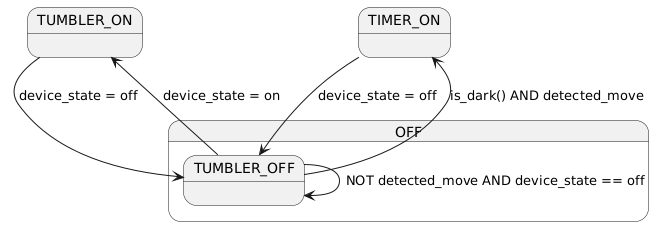

# 🌟 STM32F411CE6: Relé de Luz con Retardo, Melodías y Detector de Movimiento  

Este proyecto implementa un **sistema de control de luz** basado en un **STM32 F411**, desarrollado en **STM32CubeIDE**.  

## ✨ Características  
- 🔹 **Control de relé con retardo** – Permite encender/apagar una luz con un tiempo configurable.  
- 🔹 **Reproducción de melodías** – Generación de sonidos mediante un buzzer.  
- 🔹 **Detector de movimiento** – Activación automática mediante un sensor PIR.  
- 🔹 **Menú interactivo y configuración** – Ajustes personalizables a través de botones o interfaz UART.  

## 📜 Requisitos  
- Microcontrolador **STM32F411CE6**  
- STM32CubeIDE  
- Sensor luz BH1750
- Sensor movimiento EKMC1601111
- Pantalla SD1306
- Módulo de relé  
- Buzzer activo/pasivo  
- Fuente de alimentación adecuada  

## 🔧 Instalación  
1. Clona este repositorio:  
   ```sh
   git clone https://github.com/tu-usuario/tu-repositorio.git


## Máquina de Estados y Lógica de Funcionamiento



Este proyecto implementa una **máquina de estados** para controlar un relé de luz con temporizador, melodías, un detector de movimiento y un sistema de menú. A continuación, se detalla la lógica y las transiciones de estado.

---

## 🔄 Lógica para la Determinación de Eventos  
El sistema determina el evento actual en función del estado del dispositivo y las entradas de los sensores:

1. **TUMBLER_ON** – Si el dispositivo se enciende manualmente (`settings->device_state == true`), el evento se establece en `TUMBLER_ON`.
2. **TIMER_ON** – Si el dispositivo está apagado (`settings->device_state == false`), pero se detecta movimiento (`state->detected_move == true`), el evento se establece en `TIMER_ON`.
3. **TUMBLER_OFF** – Si el dispositivo está apagado y no se detecta movimiento, el evento se establece en `TUMBLER_OFF`.

```c
if (settings->device_state) {		
	system_state.event = TUMBLER_ON;
} 
else if (state->detected_move) { 
	system_state.event = TIMER_ON;
}	
else {
	system_state.event = TUMBLER_OFF;
}
```

---

## 🔧 Transiciones de Estado y Acciones  

El sistema responde a los eventos controlando el relé, el temporizador y otros componentes.

- **TUMBLER_ON:**  
  - Si el relé está apagado, cambia al modo `ON_TUMBLER`.
  - Detiene el temporizador si está en marcha.
  - Enciende el relé.

- **TUMBLER_OFF:**  
  - Si el relé está encendido, lo apaga.
  - Si estaba funcionando con temporizador, detiene el temporizador antes de apagar el relé.

- **TIMER_ON:**  
  - Si el relé está apagado, cambia al modo `ON_TIMER`.
  - Muestra un mensaje de bienvenida en la pantalla.
  - Inicia una melodía (si está activada).
  - Enciende el relé.
  - Inicia el temporizador.
  - Si el relé ya estaba encendido debido a un evento de temporizador anterior, reinicia el temporizador.

```c
void handle_event() {
    switch (system_state.event) {
        case TUMBLER_ON:
            if (system_state.relay_state == OFF) {
                system_state.relay_state = ON_TUMBLER;
                stop_timer();
                start_relay();
            }
        break;
        case TUMBLER_OFF:
            if (system_state.relay_state != OFF) {
                system_state.relay_state = OFF;
                if (system_state.relay_state == ON_TIMER) stop_timer();
                stop_relay();
            }
        break;
        case TIMER_ON:
            if (system_state.relay_state == OFF) {
                system_state.relay_state = ON_TIMER;
                system_state.screen_state = WELCOME;
                system_state.music_state = PLAY;
                start_relay();
                start_timer();
            } else if (system_state.relay_state == ON_TIMER) {
                start_timer();
            }
        break;
        case NONE:
        break;
    }
}
```

---

## 🎵 Gestión del Estado de la Música (`update_music_state()`)

Cuando el detector detecte movimiento, sonará una melodía y se mostrará una onda de sonido en la pantalla. Este modo se puede desactivar en la configuración.

---

## 📺 Menu

```
[ Menu ]
   ├── [ Device ]
   │   ├── [ On ]
   │   └── [ Off ]
   ├── [ Timer ]
   │   ├── [ 15s ]
   │   ├── [ 30s ]
   │   └── [ 1m ]
   ├── [ Melody ]
   │   ├── [ On ]
   │   └── [ Off ]
   ├── [ Night mode ]
   │   ├── [ On ]
   │   ├── [ Off ]
   │   └── [ Level ]
   │       ├── [ 0.1L ]
   │       ├── [ 0.5L ]
   │       └── [ 1.0L ]
   └── [ Options ]

```

---

## 📌 Resumen  
✅ El sistema **determina eventos** en función del estado del dispositivo y la detección de movimiento.  
✅ **Maneja transiciones de estado** controlando el relé, el temporizador y la melodía.  
✅ **Actualiza la pantalla** y procesa la entrada del usuario mediante botones.  
✅ Utiliza un **enfoque basado en una máquina de estados**, lo que garantiza una lógica estructurada y modular.  

🎯 **Este diseño proporciona un código modular, fácil de probar y legible para la gestión del relé, las melodías y la interacción con la interfaz de usuario.**  
